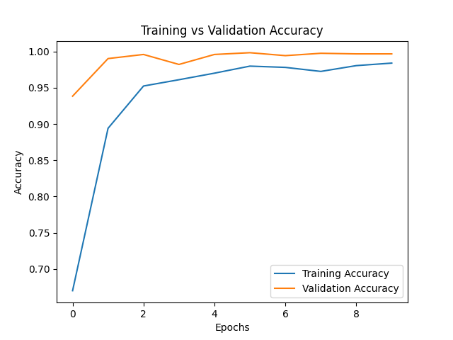
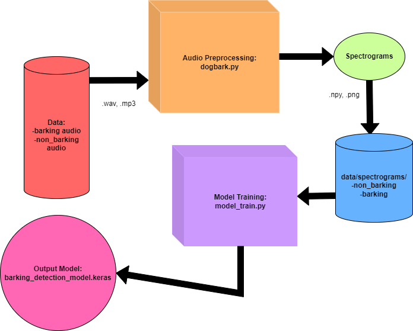
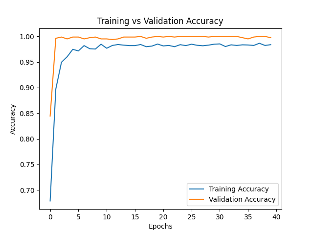
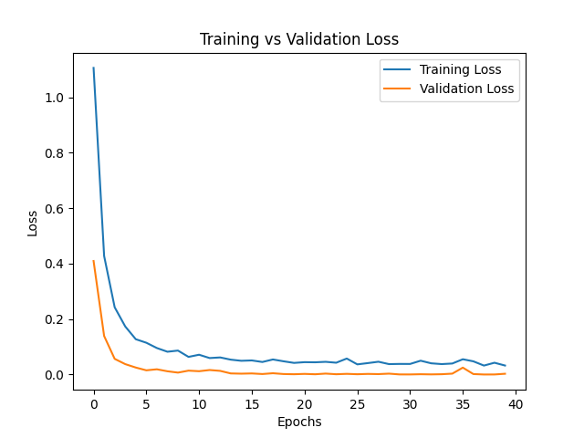

---

# Classification of Dog Barks via Supervised Learning

**Kyle Prewitt**  
December 12, 2024  

## Overview

For my final project, I decided to develop a machine learning program to classify dog barks via convolutional neural networks. Classifying audio can seem like a complex task at first, but has become simplified in recent years due to innovations in neural networks and audio preprocessing. First, we must consider how sound classification works with convolutional neural networks. Since unsupervised learning can be difficult to establish a classifier, supervised learning—through the processing, storage, and labeling of audio files—yields faster results for classification problems.

Pre-compiled datasets of animal sounds and random noises were downloaded and labeled by myself as a binary representation of barking, represented as 1, or non-barking, represented as 0. Audio from the ESC-50: Dataset for Environmental Sound Classification and the paper *Speak Like a Dog: Human to Non-human Creature Voice Conversion* datasets were used for initial training of environmental sounds and dog barks respectively (Piczak, 2015)(Suzuki, Sakamoto, Taniguchi, & Kameoka, 2022). 

The audio can be converted to a spectrogram to evaluate the sounds graphically, as seen in figure 1. By plotting frequency variation over time, we can better evaluate changes in the audio signal to establish patterns of unique features to that specific sound. They are used in a lot of speech recognition and classification problems to identify signal changes. Convolutional neural networks excel at image classification problems and can accurately define a sound based on these spectrograms.

### Figure 1: Spectrogram of a local dog barking

---

## Table of Contents
1. [Features](#features)
2. [Installation](#installation)
3. [Dataset Preparation](#dataset-preparation)
4. [Training the Model](#training-the-model)
5. [Testing the Model](#testing-the-model)
6. [How to Add Noise to Dataset](#how-to-add-noise-to-dataset)
7. [License](#license)
   
## Data Preprocessing

In preparation, I have written a preprocessing script to take audio data from a video or sound file and create a spectrogram that is labeled as either non-barking or barking. Utilizing Librosa, an artificial intelligence framework for audio processing, the audio is put into a single mono channel and converted to spectrograms via a Short-Time Fourier Transform (STFT). 

### Figure 2: The Pipeline for Audio Processing to Model via TensorFlow and Librosa

---

## Model Architecture

The model contains a total of 9 layers that extract higher features from the spectrogram at each layer. An input layer accepts the spectrogram. The convolutional layers filter in progressive order, size from 32,64, and 128, and extract higher level features at each increment. Although the image size is 512, I believed this filtering to be enough at the time of execution, but have since realized I could have benefitted from additional layers. Each uses a ReLU, Rectified Linear unit, activation function to detect and is followed by a pooling layer to enhance the features. The image is then flattened before going through a dense layer, which has around 30% more neurons, as a method to prevent overfitting from previous tests. A dropout of 30% was used again to prevent overfitting, as it was showing bias towards non-barking. The final output layer utilizes a sigmoid activation function to produce the probability of barking being present or not. Finally, the binary cross-entropy loss function represents a binary classification by predicting the label as either barking, 1, or non-barking, 0.

---

## Training and Results

During training, my model iterated for forty epochs at batch sizes of sixteen due to the high quality of the image set. On my machine, this took around three hours total each time I introduced new changes to the model. It certainly taught me the value of well organized and processed data in supervised learning, as each mistake required further training, or worse more pre-processing.

### Figure 3 & 4: Training vs Validation Accuracy and Loss



The high validation accuracy may seem as though it overfits, and in some instances does, but has high validation accuracy due to utilizing dropout. Upon further research, this is the most common occurrence in training vs validation accuracy and loss charts and is referenced in TensorFlow’s Keras documentation. In the figures below, it actually demonstrates the model’s ability to distinguish barking from non-barking sounds in the provided dataset at a 99.88% accuracy.

---

## Challenges and Future Work

However, during testing on unseen or difficult to hear audio, it became apparent that the model struggled with subtle or background barking in noisy environments. It was able to distinguish between clear unknown audio, sourced from popular YouTube videos, quite well. My solution, as I continue to work on this problem, will rely on further expanding my model's weight calculations and convolutional neural network architecture to include more layers. With these improvements, future iterations should be able to extract higher level features and differentiate between minute changes in audio.

---

## Features

- Converts audio clips into spectrograms for training.
- Adds noise to clean audio data to improve model robustness.
- Balances class distribution in the dataset.
- Implements a CNN for binary classification (`barking` vs `non_barking`).
- Saves trained models for future evaluation and inference.

---

## Installation

1. Clone the repository:
   ```bash
   git clone https://github.com/your-username/dog-bark-detection.git
   cd dog-bark-detection
   ```

2. Install the required Python libraries:
   ```bash
   pip install -r requirements.txt
   ```

---

## Dataset Preparation

1. Place your audio files in the following directory structure:
   ```
   data/
   ├── barking/
   │   ├── audio1.wav
   │   ├── audio2.wav
   │   └── ...
   └── non_barking/
       ├── audio1.wav
       ├── audio2.wav
       └── ...
   ```

2. Run the `dogbark.py` script to convert audio files to spectrograms:
   ```bash
   python dogbark.py
   ```

3. Ensure spectrograms are saved in the following structure:
   ```
   data/spectrograms/
   ├── barking/
   │   ├── spectrogram1.npy
   │   ├── spectrogram2.npy
   │   └── ...
   └── non_barking/
       ├── spectrogram1.npy
       ├── spectrogram2.npy
       └── ...
   ```

---

## Training the Model

1. Run the training script:
   ```bash
   python model_train.py
   ```

2. The trained model will be saved as `barking_detection_model.keras`.

3. To view training progress, loss, and accuracy curves, check the generated training plot.

---

## Testing the Model

1. Use the `test_model.py` script to evaluate the model:
   ```bash
   python test_model.py
   ```

2. The script outputs:
   - Accuracy
   - Precision, recall, and F1 scores
   - Confusion matrix

---

## How to Add Noise to Dataset

1. Noise is added automatically when spectrograms are generated. You can adjust the noise level in `dogbark.py`:
   ```python
   def add_noise(spectrogram, noise_level=0.1):
       noise = np.random.normal(0, noise_level, spectrogram.shape)
       return spectrogram + noise
   ```

2. Adjust the `noise_level` parameter for more or less noise during spectrogram generation.

---


## References

- Keras Team. (n.d.). Why is my training loss much higher than my testing loss? Keras. Retrieved December 10, 2024, from [Keras Documentation](https://keras.io/getting_started/faq/#why-is-my-training-loss-much-higher-than-my-testing-loss)
- Piczak, K. J. (2015). ESC: Dataset for environmental sound classification. In *Proceedings of the 23rd ACM International Conference on Multimedia* (pp. 1015–1018). ACM. [DOI: 10.1145/2733373.2806390](https://doi.org/10.1145/2733373.2806390)
- Suzuki, K., Sakamoto, S., Taniguchi, T., & Kameoka, H. (2022). Speak like a dog: Human to non-human creature voice conversion. *arXiv*. [arXiv:2206.04780](https://arxiv.org/abs/2206.04780)
- Suzuki, K., Sakamoto, S., Taniguchi, T., & Kameoka, H. (2022). Dog Dataset [Source code]. GitHub. [GitHub Link](https://github.com/suzuki256/dog-dataset)

---
## License

This project is licensed under the GNU General Public License v3.0. See the [LICENSE](LICENSE) file for details.

---
